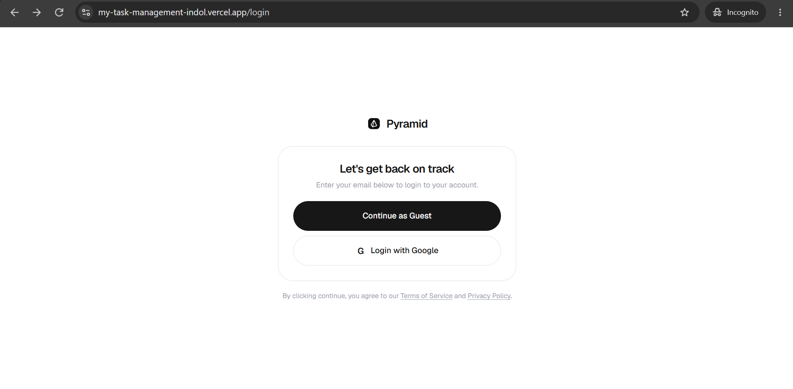
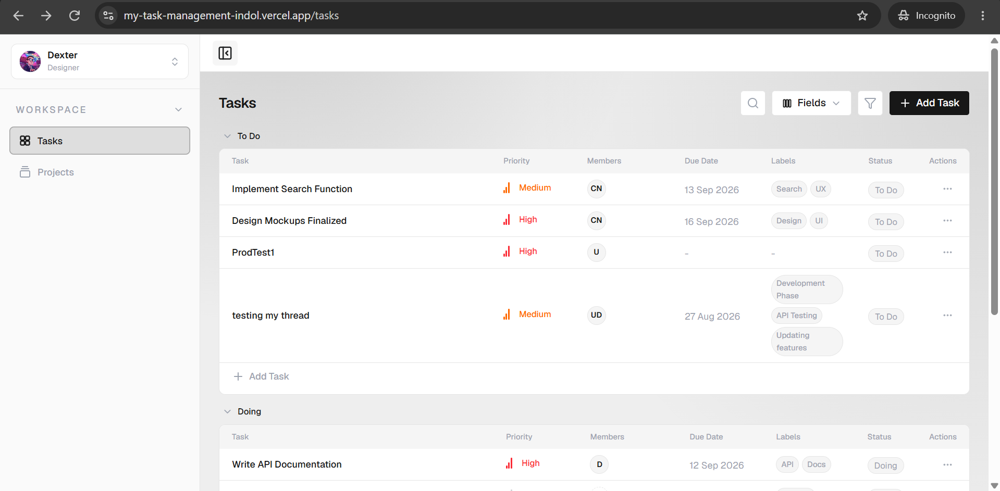
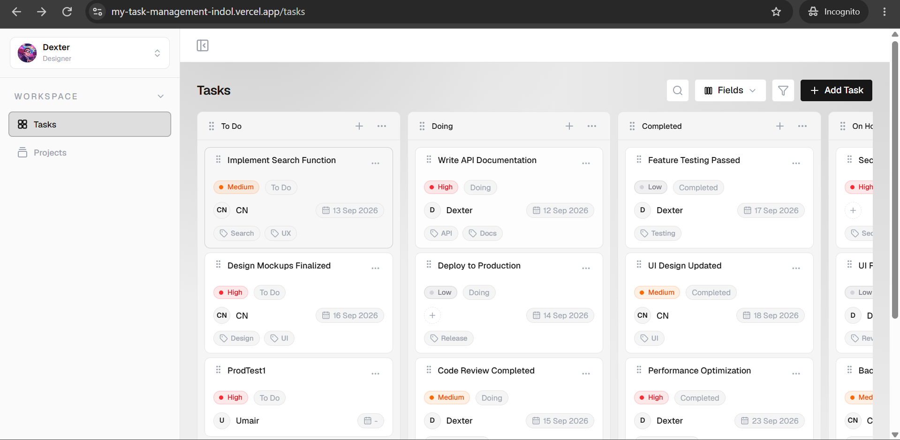
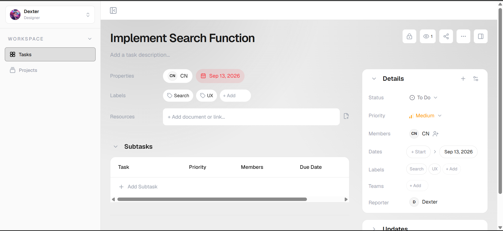
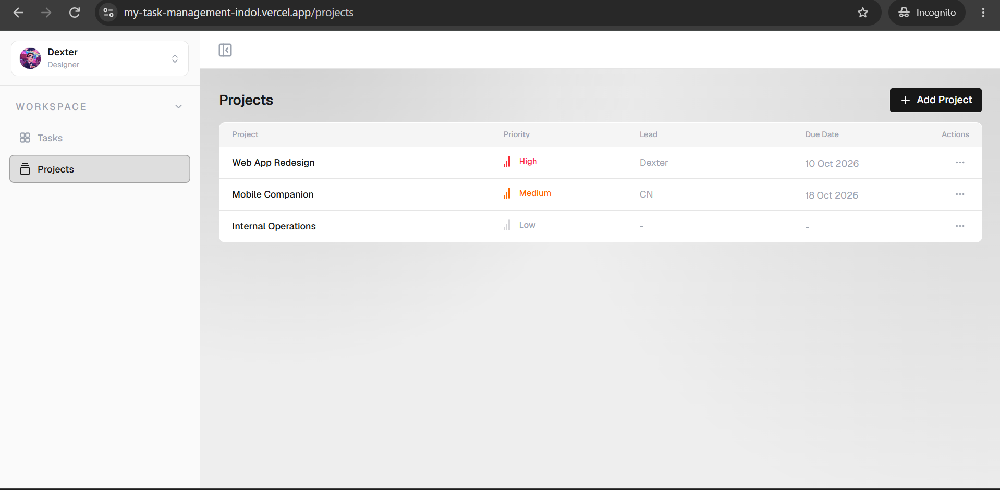
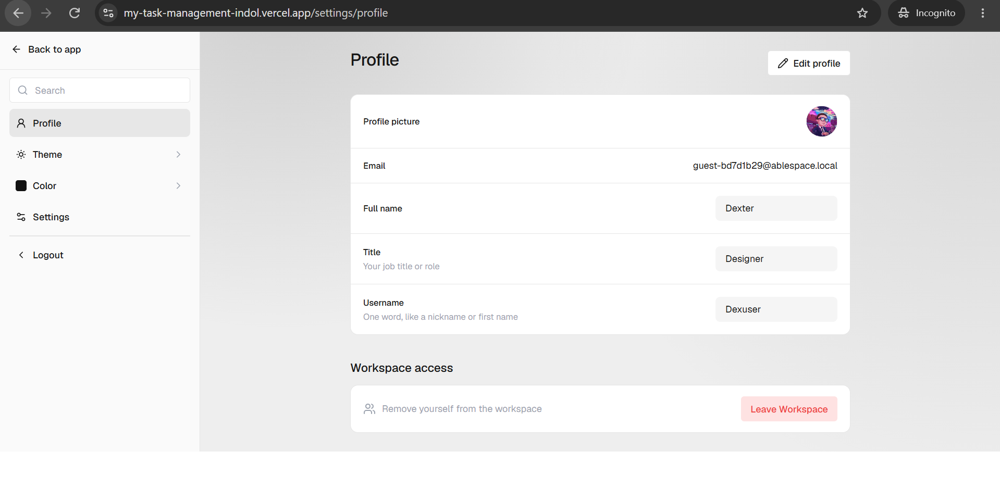

# Task Management App

A full-stack task management application built for a Full Stack Developer technical assessment. It combines a Next.js workspace UI with a NestJS REST API, Prisma ORM, and PostgreSQL persistence.

## Live Demo

- Frontend: `REPLACE_WITH_VERCEL_DEPLOYMENT_URL`
- Backend health: `REPLACE_WITH_RENDER_DEPLOYMENT_URL/health`
- Repository: [github.com/Umairyojo/My-Task-Management](https://github.com/Umairyojo/My-Task-Management)

The deployment URLs are intentionally placeholders because no production URLs are stored in this repository.

## Overview

The application provides a responsive workspace for managing tasks and projects. Tasks can be viewed as compact grouped tables or a drag-and-drop board, while the task detail route supports persisted subtasks, comments, activity history, and editable properties.

## Key Features

- Guest sessions with per-tab session isolation and a persisted local profile.
- Optional Google sign-in through NextAuth when Google OAuth credentials are configured.
- Task CRUD with list and board views, search, filters, field visibility controls, and board status drag-and-drop.
- Task detail pages with editable status, priority, assignee, dates, labels, teams, resources, subtasks, comments, replies, and activity updates.
- Project CRUD with a project detail page and related task visibility.
- Light and dark modes plus persisted ambient color palettes.
- Sidebar collapse, mobile drawer behavior, responsive toolbars, scrollable data tables, and horizontally scrollable boards.

## Tech Stack

| Layer | Technology |
| --- | --- |
| Frontend | Next.js 16 App Router, React 19, TypeScript, Tailwind CSS |
| UI icons | Lucide React |
| Authentication | NextAuth with optional Google provider, plus guest sessions |
| Backend | NestJS 11, TypeScript, REST API |
| Data access | Prisma 7 with the PostgreSQL `pg` adapter |
| Database | PostgreSQL |
| Intended hosting | Vercel frontend, Render backend, Neon PostgreSQL |

## Architecture

```text
Browser
  -> Next.js App Router frontend
  -> Next.js /api task and project proxy routes
  -> NestJS REST API
  -> Prisma + PostgreSQL driver adapter
  -> PostgreSQL database
```

The Next.js proxy layer keeps browser API calls same-origin (`/api/tasks` and `/api/projects`) while allowing the backend base URL to change by environment. Database access remains in NestJS through a reusable Prisma service and one application-level PostgreSQL pool.

## Project Structure

```text
task-management-app/
  frontend/
    src/app/                 # App Router pages and API proxy routes
    src/components/          # Auth, layout, task, project, and settings UI
    src/services/            # Typed frontend API clients
    public/                  # Static assets, including the Pyramid mark
  backend/
    prisma/                  # Schema, migrations, and seed script
    src/prisma/              # Prisma module and service
    src/tasks/               # Task, subtask, comment, and activity API
    src/projects/            # Project API
  docs/
    part-2/                  # Product analysis deliverable
    screenshots/             # Application screenshots used below
```

## Database Model

| Model | Purpose |
| --- | --- |
| `Project` | Project name, priority, lead, due date, and related tasks. |
| `Task` | Core task data, status, priority, dates, labels, teams, resources, assignee, reporter, and optional project. |
| `Subtask` | Persisted child task with priority, optional assignee, and due date. |
| `TaskComment` | Persisted task discussion, including optional one-level replies. |
| `TaskActivity` | Persisted audit-style updates generated by meaningful task changes. |

Task status values include To Do, Doing, Completed, On Hold, and Backlog. Priority values include Urgent, High, Medium, Low, and No Priority.

## API Overview

All routes below are served by the NestJS backend. The frontend calls the matching same-origin `/api/...` proxy routes.

### Health

| Method | Endpoint | Purpose |
| --- | --- | --- |
| `GET` | `/health` | Service health check returning `{ "status": "ok" }`. |

### Tasks

| Method | Endpoint | Purpose |
| --- | --- | --- |
| `GET` | `/tasks` | List tasks. |
| `POST` | `/tasks` | Create a task. |
| `GET` | `/tasks/:id` | Fetch task detail with relations. |
| `PATCH` | `/tasks/:id` | Update task properties. |
| `DELETE` | `/tasks/:id` | Delete a task. |
| `POST` | `/tasks/:id/subtasks` | Create a subtask. |
| `PATCH` | `/tasks/:id/subtasks/:subtaskId` | Update a subtask. |
| `DELETE` | `/tasks/:id/subtasks/:subtaskId` | Delete a subtask. |
| `POST` | `/tasks/:id/comments` | Create a task comment or reply. |
| `DELETE` | `/tasks/:id/comments/:commentId` | Delete a task comment. |
| `GET` | `/tasks/:id/activities` | List persisted task activity. |

### Projects

| Method | Endpoint | Purpose |
| --- | --- | --- |
| `GET` | `/projects` | List projects. |
| `POST` | `/projects` | Create a project. |
| `GET` | `/projects/:id` | Fetch project detail. |
| `PATCH` | `/projects/:id` | Update a project. |
| `DELETE` | `/projects/:id` | Delete a project. |

## Authentication and Profile

- Guest login creates a lightweight identity in `sessionStorage`, so independently logged-in browser tabs do not overwrite one another.
- Guest profile data is persisted separately per stable guest identity and powers the sidebar avatar, task attribution, and comments.
- Google OAuth is available through NextAuth only when `AUTH_GOOGLE_ID`, `AUTH_GOOGLE_SECRET`, and `AUTH_SECRET` are configured.
- No passwords are stored by the guest flow.

## Theme and Color Modes

- Light and dark modes are persisted in `localStorage` and applied before hydration to prevent visual flicker.
- Ambient palettes are persisted in `localStorage` and tint workspace canvases and navigation states while task cards, tables, dialogs, and popovers retain neutral surfaces.

## Responsive Behavior

- Desktop keeps a 256px workspace sidebar with an optional collapsed state.
- Smaller viewports use the mobile navigation drawer.
- Tables use contained horizontal scrolling where necessary.
- The task board owns its horizontal scrolling area, avoiding document-level horizontal overflow.
- Toolbars, dialogs, profile/settings content, detail rails, and popovers adapt to smaller screens.

## Local Development

### Prerequisites

- Node.js and npm
- A PostgreSQL database

### Backend

```bash
cd backend
npm install
npx prisma generate
npx prisma migrate dev
npm run start:dev
```

The backend listens on `http://localhost:3001` by default. Verify it with `http://localhost:3001/health`.

### Frontend

```bash
cd frontend
npm install
npm run dev
```

The frontend runs at `http://localhost:3000` by default.

## Environment Variables

Copy each `.env.example` file to the corresponding local environment file and supply values locally. Do not commit real credentials or production connection strings.

### Frontend (`frontend/.env.local`)

| Variable | Purpose |
| --- | --- |
| `BACKEND_URL` | Server-side base URL used by Next.js task and project API proxies. |
| `NEXTAUTH_URL` | Canonical frontend URL used by NextAuth. |
| `AUTH_SECRET` | Secret used to sign NextAuth sessions. |
| `AUTH_GOOGLE_ID` | Google OAuth client ID; required only for Google login. |
| `AUTH_GOOGLE_SECRET` | Google OAuth client secret; required only for Google login. |

### Backend (`backend/.env`)

| Variable | Purpose |
| --- | --- |
| `DATABASE_URL` | PostgreSQL connection string consumed by Prisma. |
| `FRONTEND_URL` | Additional allowed frontend origin for backend CORS. |
| `PORT` | Backend listening port; defaults to `3001`. |

## Database Migrations

Use additive Prisma migrations during local development:

```bash
cd backend
npx prisma generate
npx prisma migrate dev --name meaningful_migration_name
```

For a production deployment, apply existing migrations only:

```bash
cd backend
npx prisma migrate deploy
```

Do not use `prisma migrate reset` against shared or production databases. The seed script is separate from migrations and must not be run automatically in production.

## Deployment

The repository is structured for a split deployment:

- Deploy `frontend` to Vercel and configure its `BACKEND_URL` and, when enabled, NextAuth variables.
- Deploy `backend` to Render, configure `DATABASE_URL`, `FRONTEND_URL`, and `PORT`, then run `npx prisma migrate deploy` as part of the release process.
- Use Neon PostgreSQL (or another PostgreSQL provider) for the database connection referenced by `DATABASE_URL`.

## Design Reference

The implementation follows the supplied AbleSpace/Pyramid assessment references for compact workspace layout, sidebars, task tables, board cards, task detail rails, profile settings, authentication, and menu behavior. The goal is close visual and interaction fidelity while retaining responsive behavior and the project’s own real data model.

## Screenshots

### Login



### Tasks List



### Tasks Board



### Task Detail



### Projects



### Profile



## AbleSpace Product Analysis

The Part 2 deliverable is available at [AbleSpace Part 2 - Take Data Workflow Analysis](docs/part-2/AbleSpace_Part2_Take_Data_Workflow_Analysis.pdf). It is maintained as the submitted PDF artifact rather than duplicated or paraphrased here.

## Engineering Decisions

- Kept frontend mutations behind typed service functions and Next.js proxy routes rather than coupling browser components directly to the backend host.
- Used NestJS modules and Prisma as the backend boundary instead of adding repository abstractions that do not add value at this assessment scope.
- Used additive Prisma migrations to preserve existing task and project data.
- Kept guest identity intentionally lightweight while isolating active sessions per browser tab.
- Used persisted activity records for task changes rather than local-only UI history.

## Future Improvements

- Production user, workspace, team, and permission management.
- Full file attachment storage and richer resource metadata.
- Notification, audit, and collaboration controls beyond the current task activity stream.
- Automated unit, integration, and end-to-end test coverage.
- CI/CD checks and deployment URL configuration for a public release.

## Submission

Full Stack Developer technical assessment submission.
